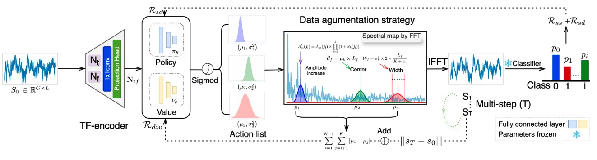

# So Far Yet So Near: Time series data augmentation with exploring non-semantic boundaries based on reinforcement learning




## Quick Start
### Install
```
# build with python3.10
conda create --name FreqSYNenv python=3.10e
conda activate FreqSYNenv 
pip install -r requirments.txt
```


### Usage
#### Before usage
1. We provide a data loading API in our code, which can be customized to suit the characteristics of specific datasets.
2. The detailed loading functions are available in `Code/Utils/Func.py`.


#### Classifier Training
1. The downstream task classifier should be integrated into our reinforcement learning framework, and must be provided prior to the reinforcement learning training process.
2. We provide a basic training script for MMCNN, a well-known classifier in the EEG signal domain, which can be used by `python Code/Train/Classifier_train.py --dataset your_dataset`
3. Tips: the path of your dataset should be set in the script before training 


#### Augmentation Agent Training
1. Before training the augmentation agent within the RL framework, the RL training configuration must be set. We provide an example in `Config/train_config_2a.json`, which should be adjusted to fit specific datasets.

2. For training the RL Agent, you can use the following command:
    ```
    python Code/train.py --train_name=your_train_name --train_cfg=/path/to/your/train/config.json
    # for more arguments setting, you can use:
    python Code/train.py --help
    ```

#### Data Augment 
1. For getting the Augmentated data which generated by the agent, the following command should be used:
    ```
    python3 Code/Test/Get_Aug_data.py --train_cfg /same/as/the/config/in/train --agent_path /the/best/agent/saved/in/train
    ```
2. After getting the augmented data, the classifier should be trained again with augmented data by using:
    ```
    # Tips: the augmented data path should be setting before
    python Code/Train/Classifier_train.py --dataset your_dataset --train_mode aug
    ```

## Reference
1. [RL-PPO](https://github.com/Lizhi-sjtu/DRL-code-pytorch)
